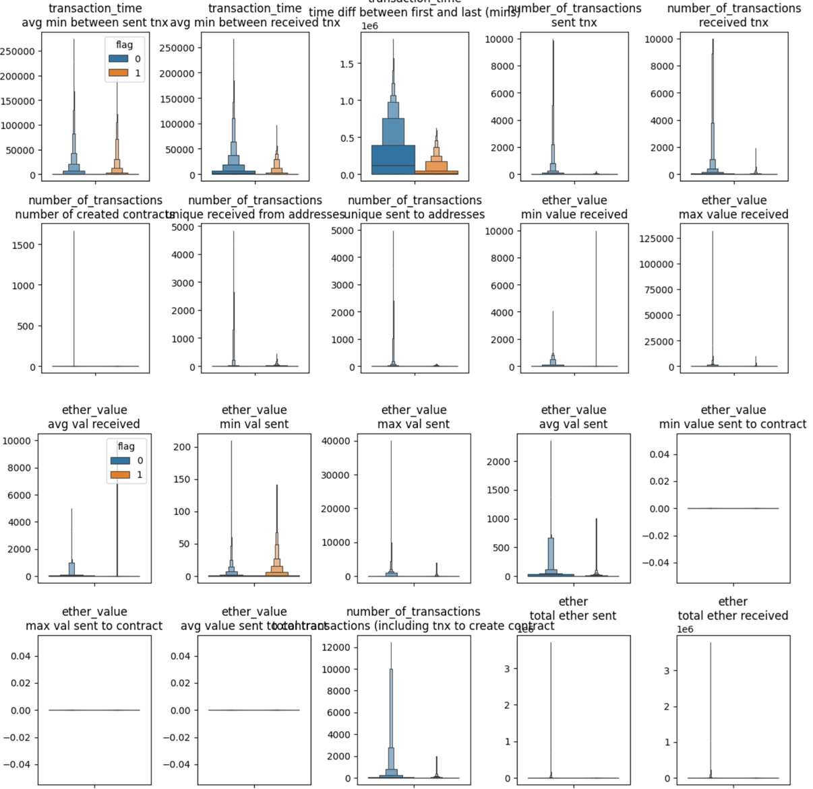
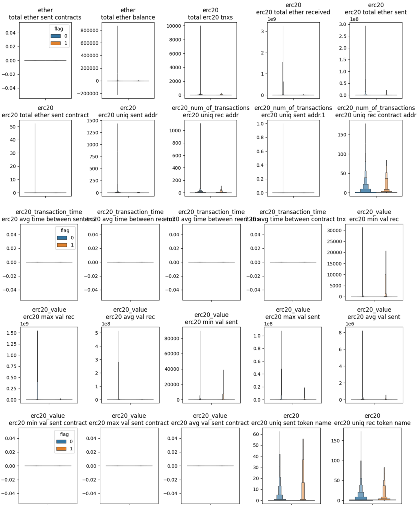
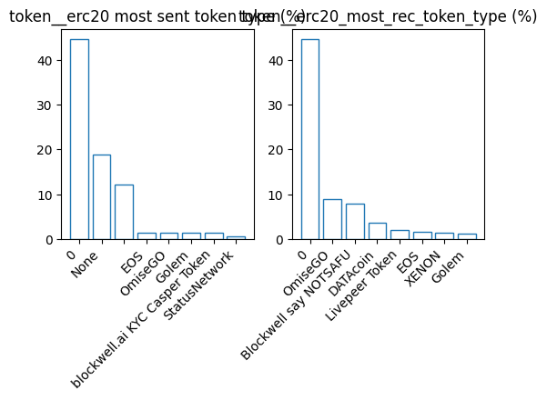
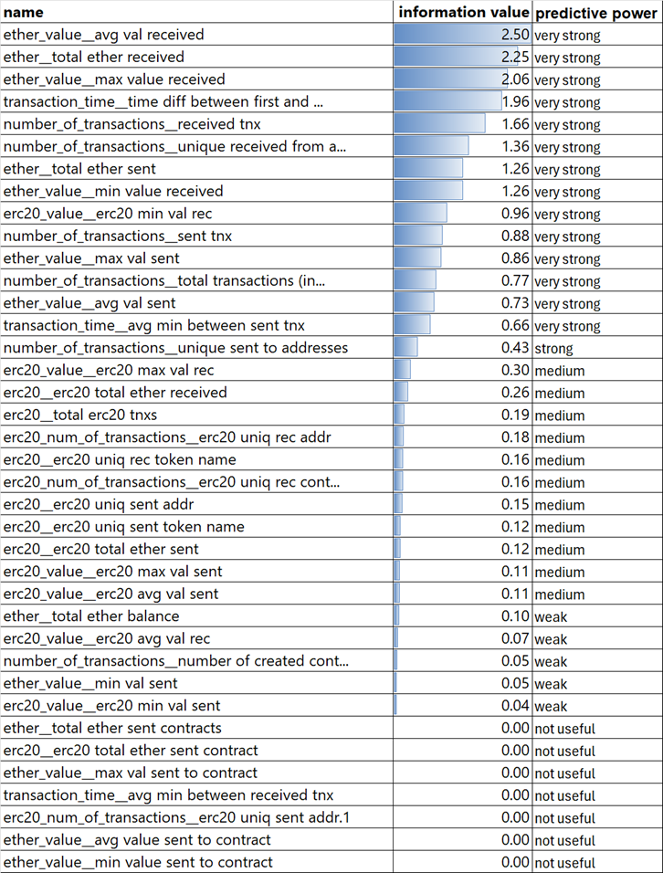
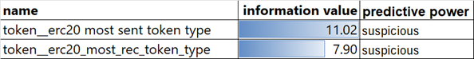
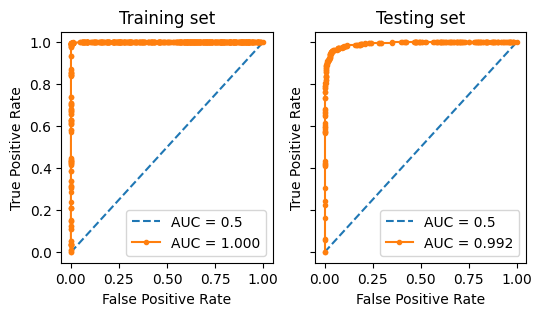
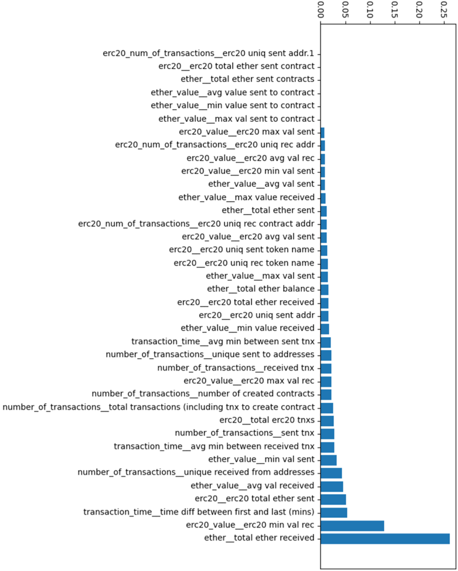

# Notes:

This dataset seems to be too easy to solve.

The dataset is very likely to be synthetically generated.

For a reference, please find another repository [here](https://github.com/rendy-k/Loan-Approval-Model).

It contains loan approval Machine Learning modeling. Anomaly detection and customer segmentation are on progress.

   

# Fraud Detection for Ethereum Transaction

(Work in Progress)

Data Source: [Kaggle](https://www.kaggle.com/datasets/vagifa/ethereum-frauddetection-dataset/data)

   

# Ethereum Fraud scoring (Machine Learning model)

## 1. Exploratory Data Analysis (EDA)

### 1a. Data Duplicates

There are 9,841 samples in the dataset.

There are 18 duplicated samples. The duplicated samples are removed.

### 1b. Data Distribution

Almost all features are numerical type, except for the 'token' features.

The features related to 'ERC20' have missing values. The other features do not have missing values.

#### <u> Target Variable </u>

This is an imbalanced dataset as 22.2% of the samples are 'fraud' and the other 77.8% are not fraud. This is common in fraud detection.

#### <u> Numerical Features </u>

The following boxenplots do not show outliers to focus on the majority of the samples.  

Most of the values in the numerical features are close to zero, or zero. The boxenplot visualizations also show that non-fraud samples generally have higher values than fraud samples do in almost all numerical features.

There are 7 features with all of the values zero. These features are removed and not used in the model training.

#### <u> Categorical Features </u>

There are 2 categorical values, the most sent and received ERC20 token types. There are 306 and 468 unique categorical values in the most sent and received token types respectively. 

The most sent token types are '0', 'None', and ' '. These 3 may be the same as there is no token. However, the samples with the blank ' ' value are all flagged as fraud.

The most received token types are '0', 'OmiseGo', and 'Blockwell say NOTSAFU'. All of the 'Blockwell say NOTSAFU' samples are flagged as fraud.

### 1c. Train-test split

Twenty percent of the dataset is allocated for the validation set. The training and validation split is applied based on the label stratification.

## 2. Feature Engineering

Optimal binning is used to gain insights from the feature information values. The information value of each feature indicates how strongly an individual feature can predict the label. The table below shows how strong the predictive power of each feature.

The missing values in the numerical values are filled with zero.

The categorical values are removed because the predictive powers are too high and suspicious.

## 3. Model Development and Evaluation

| Metrics | Training | Testing | Validation |
| ------ | ------ | ------ | ------ |
| AUC ROC | 1.000 | 0.992 | 0.952 |
| Precision | 0.99 | 0.91 |  |
| Recall | 1.00 | 0.93 |  |
| F1-Score | 0.99 | 0.92 |  |
| Accuracy | 1.00 | 0.96 |  |

### Feature Importances

